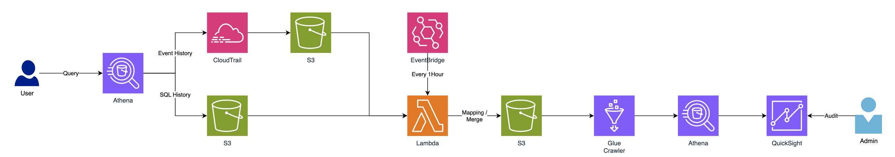

# athena_regulation

## Architecture


## EventBridge
- Lambda Trigger
- Cron expression : cron(0 * * * ? *)


## Lambda
- Call the query executed in Athena and the event in Cloudtrail, concatenate them by query_execution_id, and store them in S3
- Path : src/lambda_code.py
- python3.10
- Change any of the following as needed (s3_bucket name must be changed)
    ```
    region_name = 'ap-northeast-2'
    s3_bucket = 'chiholee-athena-regulation'
    ```

## Glue
- Using Glue Cralwer to create a table that can be used by athena
- output table : athena_cloudtrail_info, athena_sql_info
- Data Soure : s3://chiholee-athena-regulation/ (Need to rename bucket)

## Table
### athena_cloudtrail_info
Event details data in Cloudtrail
| Column Name | Type | PK | Description |
| -------- | -------- | -------- | -------- |
| event_id | string | V | ... |
| query_execution_id | string |  | ... |
| request_id | string |  | ... |
| event_name | string |  | ... |
| type | string |  | ... |
| principal_id | string |  | ... |
| arn | string |  | ... |
| account_id | string |  | ... |
| access_key_id | string |  | ... |
| user_name | string |  | ... |
| event_source | string |  | ... |
| source_ip_address | string |  | ... |


### athena_sql_info
Queries performed on athena
| Column Name | Type | PK  | Description |
| ----------- | ---- | --- | ----------- |
| query_execution_id | string | V | ...|
| catalog | string | | ...|
| database | string | | ...|
| statement_type | string | | ...|
| result_configuration | string | | ...|
| submission_datetime | string | | ...|
| completion_datetime | string | | ...|
| state | string | | ...|
| substatement_type | string | | ...|
| workgroup | string | | ...|
| query | string | | ...|


## Athena Audit Query
```sql
select *
from athena_cloudtrail_info a,
     athena_sql_info b
where a.query_execution_id = b.query_execution_id;
```

## QuickSight
...


## ToDO
- merge 된 데이터도 s3에 저장?
- S3 에 저장 할 때 파티션
- 데이터 타입 정리 (날짜 컬럼 string -> timestamp)
- quicksight
- 테이블 Description 정리