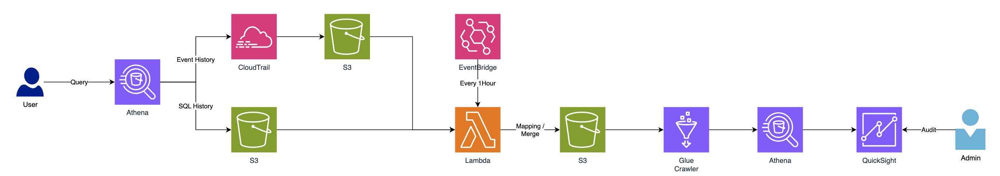

# athena_regulation



### Table : athena_cloudtrail_info
| Column Name | Type | PK | Description |
| -------- | -------- | -------- | -------- |
| event_id | string | V | ... |
| query_execution_id | string |  | ... |
| request_id | string |  | ... |
| event_name | string |  | ... |
| type | string |  | ... |
| principal_id | string |  | ... |
| arn | string |  | ... |
| account_id | string |  | ... |
| access_key_id | string |  | ... |
| user_name | string |  | ... |
| event_source | string |  | ... |
| source_ip_address | string |  | ... |


### Table : athena_sql_info
| Column Name | Type | PK  | Description |
| ----------- | ---- | --- | ----------- |
| query_execution_id | string | V | ...|
| catalog | string | | ...|
| database | string | | ...|
| statement_type | string | | ...|
| result_configuration | string | | ...|
| submission_datetime | string | | ...|
| completion_datetime | string | | ...|
| state | string | | ...|
| substatement_type | string | | ...|
| workgroup | string | | ...|
| query | string | | ...|


### Athena Audit Query
```sql
select *
from athena_cloudtrail_info a,
     athena_sql_info b
where a.query_execution_id = b.query_execution_id;
``````